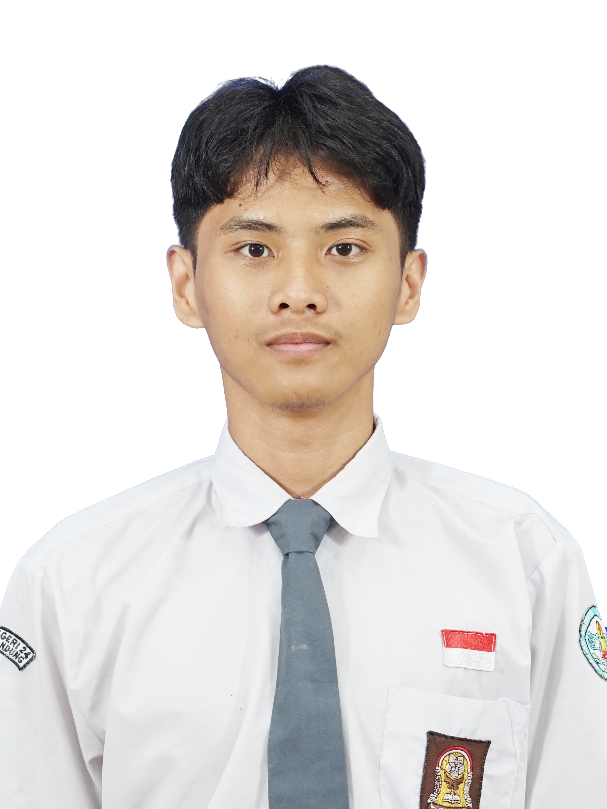
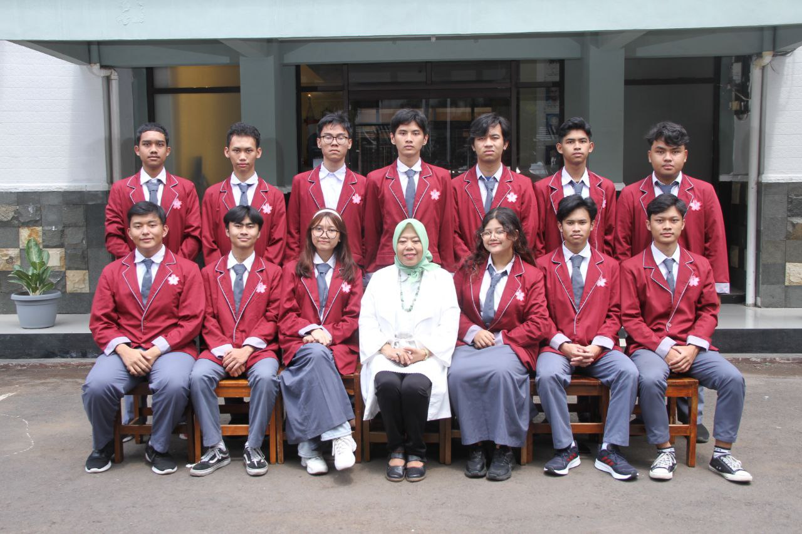
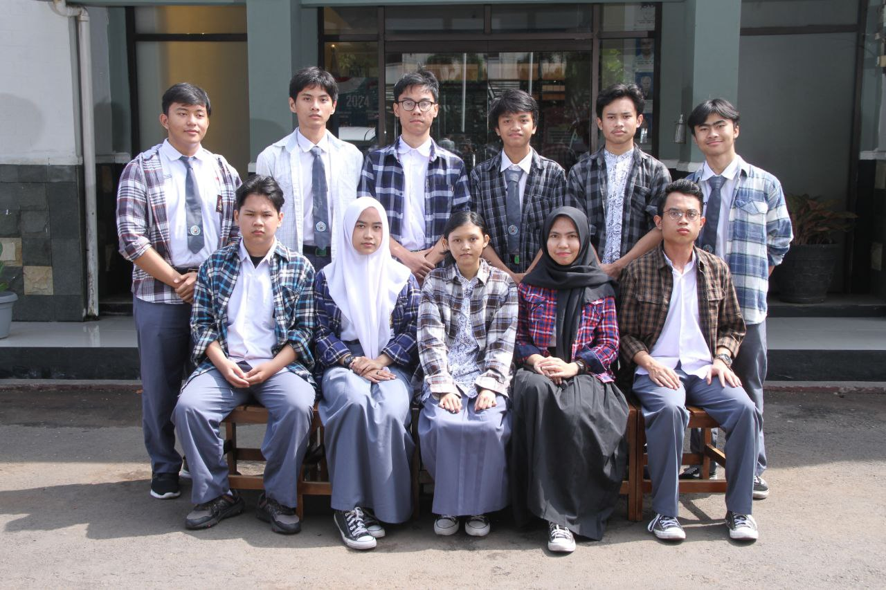
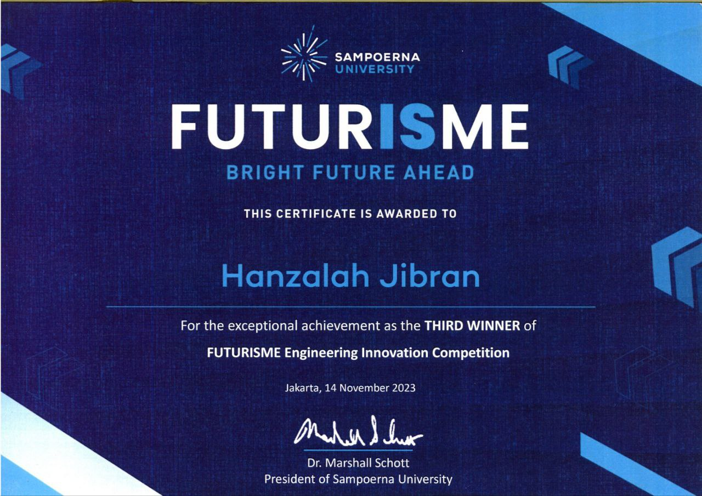
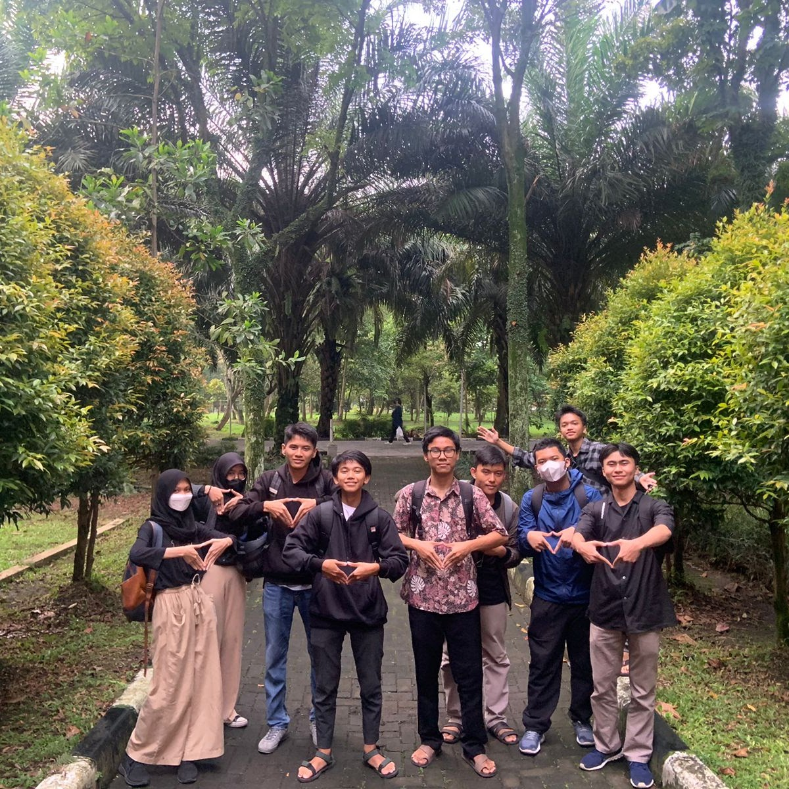
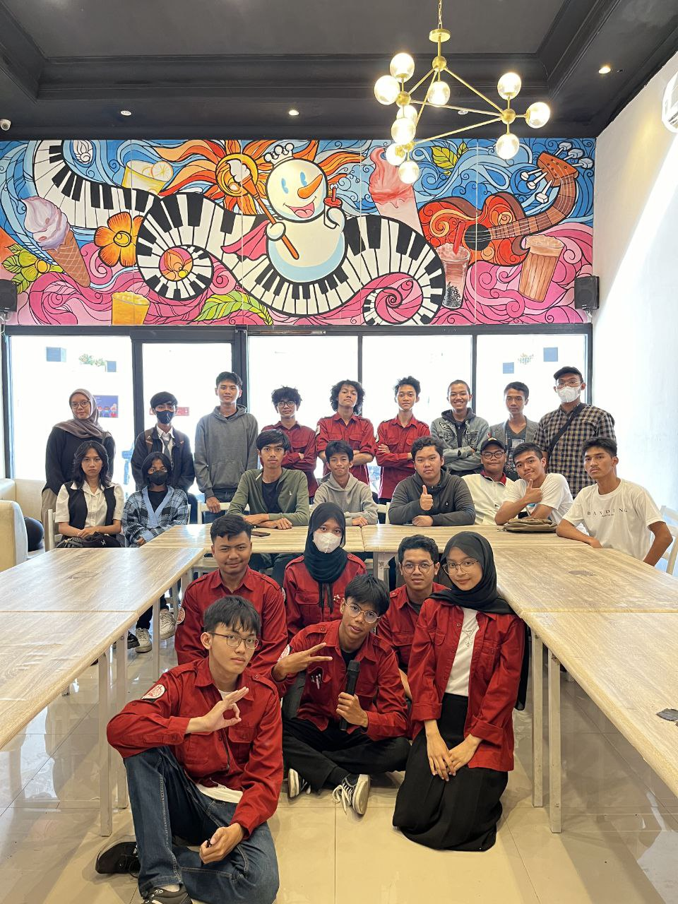

## Personal Information
- **Full Name:** Hanzalah Jibran
- **Birthplace, day:** Bandung, Maret 2005
- **Current Address:** Bandung, Indonesia
- **Background:** Programming, design, animation
## Summary
Hello, I'm Jibran, the author of this blog. Welcome to my site, where I'll share a variety of content about technology. I'm currently applying to college with a focus on Architecture and Engineering. I have a strong drive to learn and advance through higher education and aim to create innovations that benefit society.
## Education
SMAN 24 Bandung
Juli 2021 - Juni 2024
1st-5th Semester Cumulative Unweighted GPA: 3.3 (87.8%)
## Organization
- **Aishiteru Nihongo(AINO) (24 Japanese Club)**

  - **President** ; October 2023 - January 2024 ; Led the organization and creating several programs related to the development of Japanese culture & language
- **Informatika 24**

  - **HR Staff** ; January 2023 - January 2024 ; Responsible for managing recruitment, hiring, and onboarding of organization personnel
## Awards
- **ICEE ITB FTSL Innovation Summit 2023 - Grand Champion**

- **Sampoerna University FUTURISME Engineering Competition - 3rd Place**

- **EdgeHacks Winter 23/24 - Honorable Mentions**
## Projects & Activities
- **ICEE ITB FTSL Innovation Summit 2023**

- **Informatika 24 Goes to Telkom University**

- **AINOxSoNoBar (Soshonbu No Benkyou Besar)**

