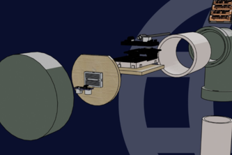

**Automatic Flood Early Warning System and Eco-drainage (AFEWS-E)** is a project created to compete in FTSL Innovation Summit 2023 by the AF3WS team. Learn more at our [Devpost page](https://devpost.com/software/automatic-flood-early-warning-system/)
## Inspiration
Over the course of hundreds years, floods have been worsening since its first strike in Indonesia. Mainly because the ground’s ability to contain water is reduced to an irreversible level. Although several methods had been applied in order to restore the absorbability back to normal, countless urban areas which include large buildings are currently unreachable to reforestations. And therefore, rerouting of excess water is crucial in order to prevent floods from happening.

We must prevent this devastating disaster from happening in the future by creating ways for society to adapt to geological situations around the country. However, there are no significant results from these somewhat traditional methods.
## What it does
This water level detector will work in 3-steps, automatically sending and after receiving the reflected waves, the tool will immediately send the sound to the mainboard and warn local residents via a module installed onboard and opens up a valve for the upper water bank to route excess water into the lower bank.

The automation is made possible with the help of our ever lovely Telegram bot, Doodadeed. Fear not, we use big capacity batteries that can last up to a year, and the requirement of manual checking is none.
## How we built it
We programmed a NodeMCU ESP-12E as the mainboard connected to an ultrasonic sensor. We also hooked up a few necessary components such as a voltage regulator, a servo, and some resistors. The design is simple enough for anyone to learn. And the components aren’t so pricey either. Because we wanted AFEWS-E to be easily build by anyone across the globe!
## Future Planning
The tool will use Artificial Intelligence Design technology that is more ergonomic Use of a more appropriate chip to detect greater areas Waterproof design Solar panel utilization
